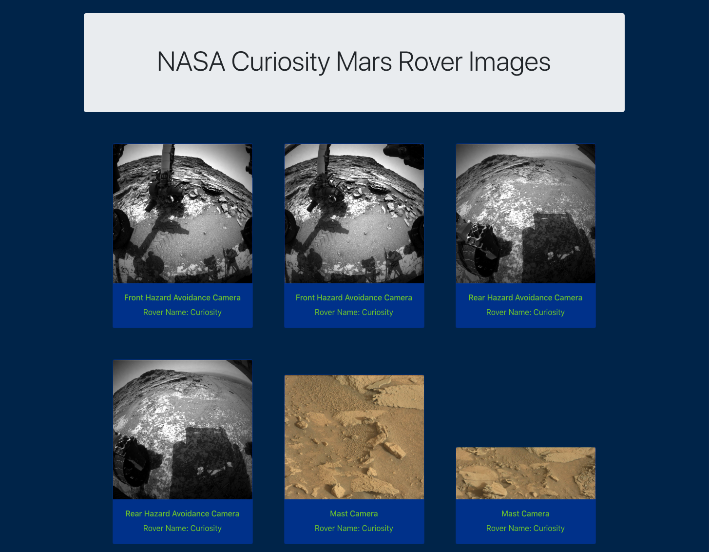

# NASA Mars Rover images and other details

# => NASA API Data fetched by GraphQL/Apollo Server and displayed on React client
## NOTE: Minimal styling applied with Bootstrap because goal was just to consume data using GraphQL and display on front-end with React.
# To View:

## 1) go to [this CodeAndSandbox](https://tvfqp.sse.codesandbox.io/) to start server

## 2) Navigate to client folder then
##    a) yarn start
##    b) in browser open localhost:3000

  

